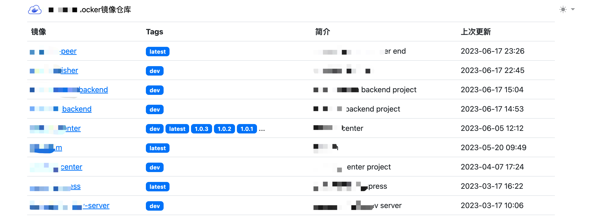
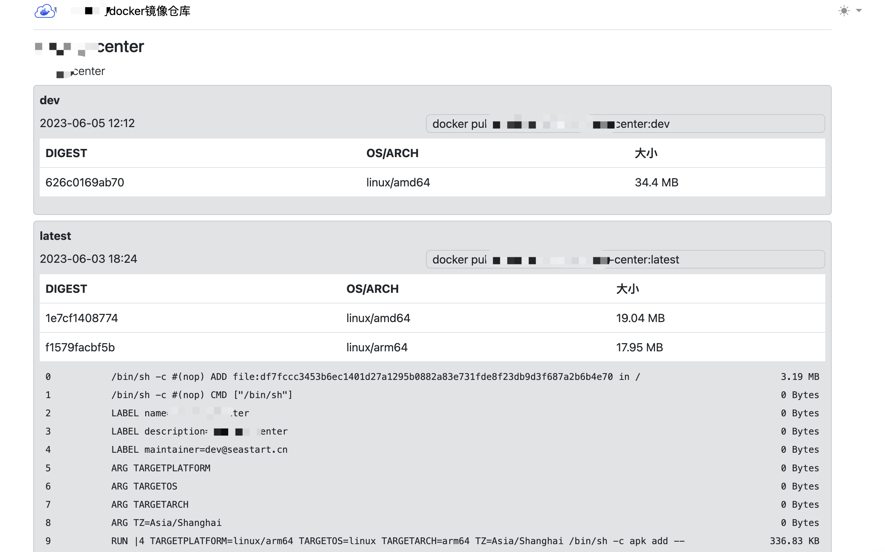

# docker registry webui in 1 file.  
inspired by: [jc21/docker-registry-ui](https://github.com/jc21/docker-registry-ui)  [joxit/docker-registry-ui](https://github.com/Joxit/docker-registry-ui)



## usage
there are 3 ways to use this project.
### binary
download binary from [release]()
```bash
./registry-webui -config=default.yml
# open browser: localhost:8081
```

### docker
```bash
# map default.yml to /var/www/registry-webui/config/default.yml and run
docker run --name registry-webui -v default.yml:/var/www/registry-webui/config/default.yml -p 8081:8081 -d seastart/registry-webui:latest
# open browser: localhost:8081
```
or docker-compose
```yml
version: "3.3"

services:
    registry-webui:
      image: seastart/registry-webui:latest
      volumes:
         - ./default.yml:/var/www/registry-webui/config/default.yml
         - ./logs:/var/www/registry-webui/logs
      ports:
         - "8081:8081"
```

### build it yourself
```bash
make build
./registry-webui -config=default.yml
```

## config
create your own yml configuration

```yml
app:
  # if env not prod, will show more information when running
  env: prod
  # title for page
  title: "ather shu's docker hub"
  # refresh all repoes interval
  fresh_interval: 10m
registry:
  # registry v2 api prefix, the real api will be `$url/v2/_catalog`
  # see https://docs.docker.com/registry/spec/api/#overview
  url: "https://yourdocker.com"
  # registry api authentication
  username: "your username"
  password: "your password"
```

## docker label
you can add label to your local docker image, these info will show on webui.
```dockerfile
LABEL name="registry-webui"
LABEL description="webui for private registry"
LABEL maintainer="dev@seastart.cn"
LABEL changelog="first publish"
```

## todo
- search repo
- add Image hierarchy `from: xx` like hub.docker.com
- tags pagination

## feel free to give feedback